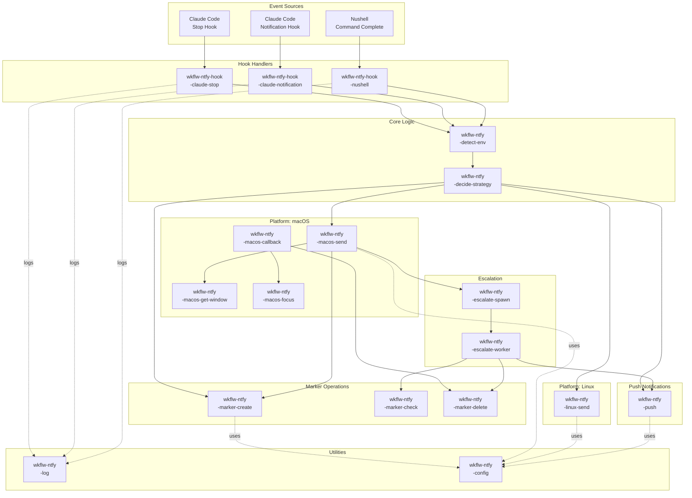
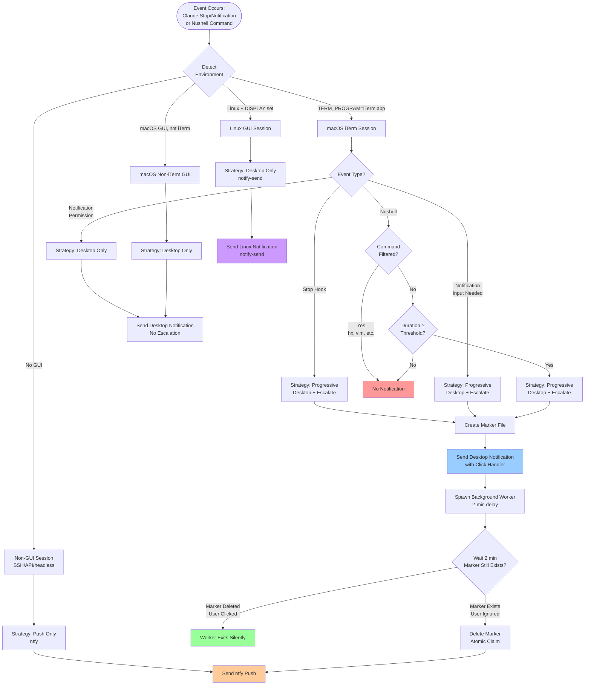
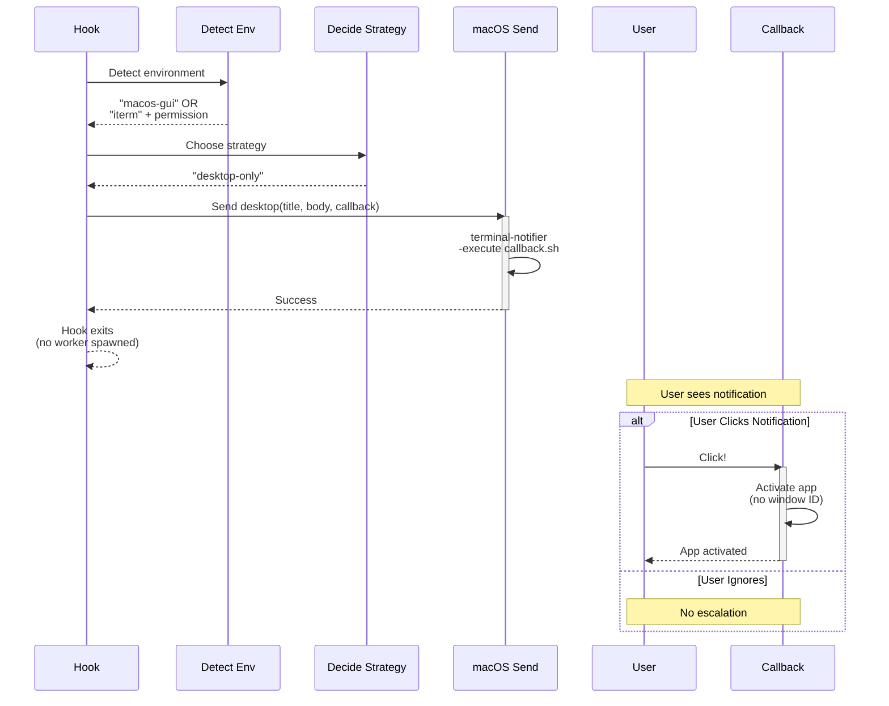
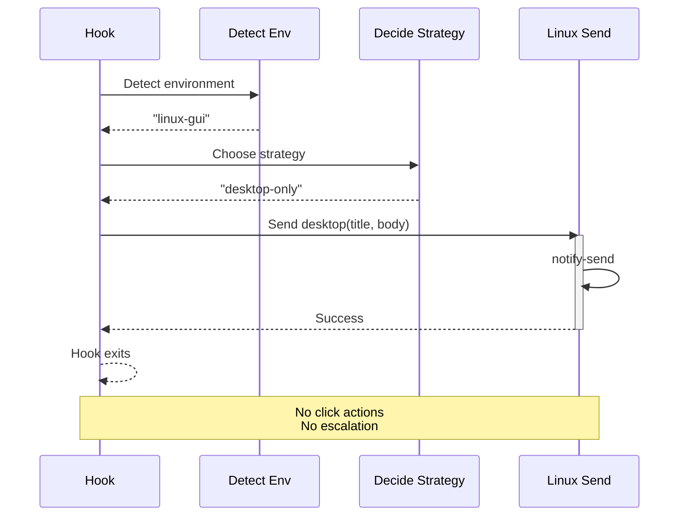
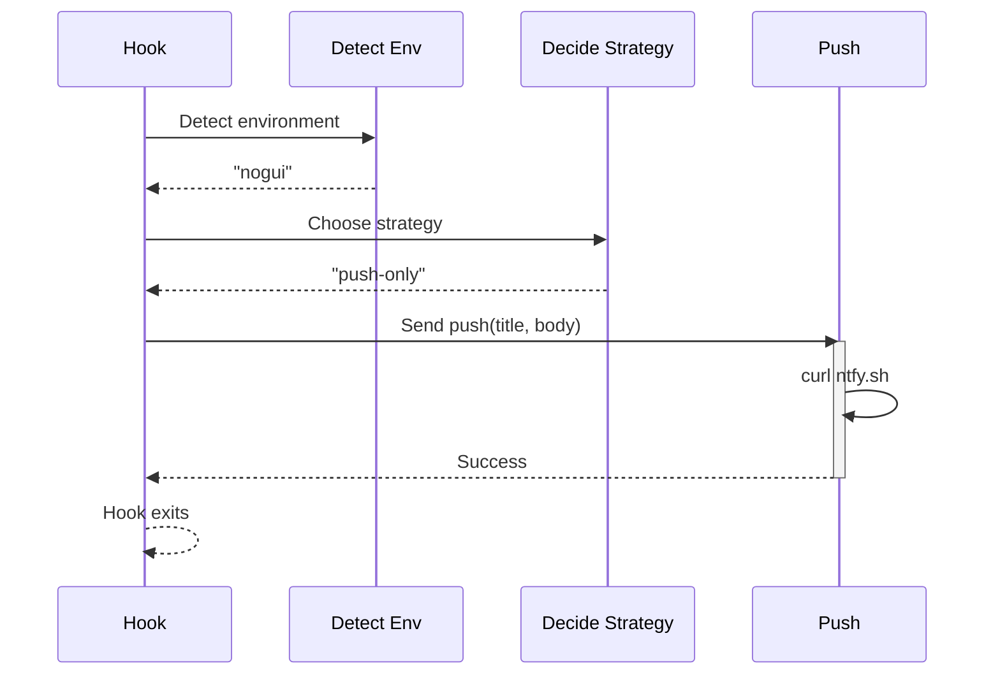

# Workflow Notifications - Engineering Design

**Status:** V2 Design
**Version:** 2.0
**Replaces:** Unspecced v1 implementation from PR #9
**Dependencies:** [Product Design](../design-product/2025-11-10-workflow-notifications.md)

## Architecture Principles

### 1. Unix Philosophy: Small, Composable Tools

Build small scripts that do one thing well, composed via shell orchestration.

**Rationale:**
- Each script is independently testable
- Clear boundaries reduce cognitive load
- Easier to mock dependencies for testing
- Failures are isolated to single components

**Example:**
```bash
# NOT this (monolithic):
wkflw-ntfy-send-notification --type=claude --strategy=progressive ...

# YES this (composable):
wkflw-ntfy-marker-create "$marker_id"
wkflw-ntfy-macos-send "$title" "$body" "$callback_script"
wkflw-ntfy-escalate-spawn "$marker_id" "$delay"
```

### 2. Hierarchical Naming for Clarity

All components use `wkflw-ntfy-*` prefix with hierarchical structure.

**Pattern:** `wkflw-ntfy-{category}-{function}`

**Examples:**
- `wkflw-ntfy-marker-create` - Marker file operations / create
- `wkflw-ntfy-macos-send` - macOS platform / send notification
- `wkflw-ntfy-hook-claude-stop` - Hook handlers / Claude stop hook

**Rationale:**
- Tab completion groups related scripts
- Clear ownership and purpose from name alone
- Maintainers can find related components quickly

### 3. 12-Factor Configuration

All configuration via environment variables, with sensible defaults.

**Rationale:**
- Easy to override in tests (no config file mocking)
- Clear documentation (env vars are self-describing)
- Works across shells and environments

**Pattern:**
```bash
# Read config with defaults
THRESHOLD="${WKFLW_NTFY_NUSHELL_THRESHOLD:-90}"
DELAY="${WKFLW_NTFY_ESCALATION_DELAY:-120}"
DEBUG="${WKFLW_NTFY_DEBUG:-0}"
```

### 4. Testability First

Design for testing without GUI interaction or complex mocks.

**Strategies:**
- Mock external tools (terminal-notifier, osascript, curl) as executables in `test/mocks/`
- Use `PATH` manipulation to inject mocks
- Verify behavior by checking mock invocations (args, call counts)
- Test async workers synchronously by setting delay to 0

**Example:**
```bash
# In test:
export PATH="$TEST_DIR/mocks:$PATH"  # Inject mocks
export WKFLW_NTFY_ESCALATION_DELAY=0  # No waiting in tests
wkflw-ntfy-escalate-spawn "$marker_id" "$delay"

# Verify mock was called:
assert_file_contains "mocks/curl.log" "POST https://ntfy.sh"
```

### 5. Fail Gracefully

Missing tools degrade functionality but don't break the system.

**Pattern:**
```bash
if ! command -v terminal-notifier &>/dev/null; then
    log_warning "terminal-notifier not found, falling back to ntfy only"
    wkflw-ntfy-push "$title" "$body"
    exit 0
fi
```

**Rationale:**
- Users get some notification (ntfy) even if preferred tool (terminal-notifier) is missing
- Warnings logged for troubleshooting
- No catastrophic failures

### 6. Race Condition Prevention

Delete marker files **before** slow operations to prevent duplicate actions.

**Pattern:**
```bash
# CORRECT - delete before slow operation
if [ -f "$marker_file" ]; then
    rm -f "$marker_file"  # Delete first (idempotent with -f)
    # Now perform slow operation safely
    curl -X POST ...
fi

# WRONG - delete after slow operation
if [ -f "$marker_file" ]; then
    curl -X POST ...  # Slow operation
    rm -f "$marker_file"  # Too late! Another process may have also started curl
fi
```

**Rationale:**
- Multiple processes (click handler, background worker) may check the same marker concurrently.
- Deleting the marker before the slow operation ensures only the first process performs the action.
- `rm -f` is idempotent (doesn't error if file missing), so the second process simply exits.
- This prevents both window focusing AND ntfy push from happening for the same event.

## Component Architecture

### High-Level Component Diagram



### Notification Strategy Decision Tree



## Directory Structure

```
private_dot_local/
├── bin/
│   └── (empty - hooks call lib scripts directly)
│
└── lib/
    └── wkflw-ntfy/
        ├── README.md                              # Architecture overview for maintainers
        │
        ├── hooks/
        │   ├── claude-stop.sh                     # Claude Stop hook entry point
        │   ├── claude-notification.sh             # Claude Notification hook entry point
        │   └── nushell.nu                         # Nushell hook functions (def --env)
        │
        ├── core/
        │   ├── wkflw-ntfy-detect-env              # Detect terminal environment
        │   ├── wkflw-ntfy-decide-strategy         # Choose notification strategy
        │   ├── wkflw-ntfy-config                  # Load configuration from env vars
        │   └── wkflw-ntfy-log                     # Logging utility (debug/warning/error)
        │
        ├── marker/
        │   ├── wkflw-ntfy-marker-create           # Create marker file
        │   ├── wkflw-ntfy-marker-check            # Check if marker exists
        │   └── wkflw-ntfy-marker-delete           # Delete marker file
        │
        ├── macos/
        │   ├── wkflw-ntfy-macos-send              # Send desktop notification (terminal-notifier)
        │   ├── wkflw-ntfy-macos-callback          # Click handler callback script
        │   ├── wkflw-ntfy-macos-get-window        # Get iTerm window ID (AppleScript)
        │   └── wkflw-ntfy-macos-focus             # Focus iTerm window by ID (AppleScript)
        │
        ├── linux/
        │   └── wkflw-ntfy-linux-send              # Send desktop notification (notify-send)
        │
        ├── escalation/
        │   ├── wkflw-ntfy-escalate-spawn          # Spawn background escalation worker
        │   └── wkflw-ntfy-escalate-worker         # Background worker (checks marker, sends push)
        │
        └── push/
            └── wkflw-ntfy-push                    # Send ntfy push notification

dot_config/
└── nushell/
    └── config.nu (or env.nu)
        # Source nushell hooks:
        # source ~/.local/lib/wkflw-ntfy/hooks/nushell.nu

dot_claude/
└── settings.json (template)
    # Hook configuration (generated by chezmoi):
    # "hooks": {
    #   "Stop": [{"type": "command", "command": "~/.local/lib/wkflw-ntfy/hooks/claude-stop.sh"}],
    #   "Notification": [{"type": "command", "command": "~/.local/lib/wkflw-ntfy/hooks/claude-notification.sh"}]
    # }

dot_local/state/wkflw-ntfy/
├── config                                         # Auto-generated by chezmoi (ntfy topic, etc.)
├── markers/                                       # Marker files for progressive escalation
│   └── {event-type}-{timestamp}-{pid}
├── debug-{pid}.log                                # Debug logs (when WKFLW_NTFY_DEBUG=1)
└── warnings.log                                   # Warning messages (missing tools, etc.)

test/
├── wkflw-ntfy/                                    # Workflow notification system tests
│   ├── unit/
│   │   ├── test_marker.bats                       # Marker operations
│   │   ├── test_macos_send.bats                   # macOS notifications
│   │   ├── test_linux_send.bats                   # Linux notifications
│   │   ├── test_escalate.bats                     # Escalation worker
│   │   ├── test_detect_env.bats                   # Environment detection
│   │   └── test_config.bats                       # Configuration loading
│   │
│   ├── integration/
│   │   ├── test_claude_stop_flow.bats             # Claude Stop hook → notification
│   │   ├── test_claude_notification_flow.bats     # Claude Notification hook → notification
│   │   ├── test_nushell_flow.bats                 # Nushell → notification
│   │   └── test_progressive_escalation.bats       # Desktop → delay → push flow
│   │
│   ├── mocks/
│   │   ├── terminal-notifier                      # Mock macOS desktop notification
│   │   ├── notify-send                            # Mock Linux desktop notification
│   │   ├── osascript                              # Mock AppleScript (window ID, focus)
│   │   ├── curl                                   # Mock ntfy push
│   │   ├── tty                                    # Mock TTY detection
│   │   └── README.md                              # Mock documentation
│   │
│   └── helpers/
│       └── test_helpers.bash                      # Shared test utilities (setup, teardown, asserts)
│
└── (other project tests outside wkflw-ntfy scope)
```

## Component Responsibilities

### Hook Entry Points

**`hooks/claude-stop.sh`**
- Receives Claude Stop hook JSON via stdin.
- Extracts: `session_id`, `transcript_path`, `cwd`, `message` (last assistant message).
- Calls `wkflw-ntfy-detect-env` to determine environment.
- Calls `wkflw-ntfy-decide-strategy` to choose notification approach.
- Orchestrates notification flow based on strategy.

**`hooks/claude-notification.sh`**
- Receives Claude Notification hook JSON via stdin.
- Extracts: `notification_type` (permission_prompt or idle_input), `message`, `cwd`.
- Calls detection/strategy logic.
- For `permission_prompt`: desktop only, no escalation.
- For `idle_input`: progressive escalation.

**`hooks/nushell.nu`**
- Nushell hook functions: `ntfy-pre-execution-hook`, `ntfy-pre-prompt-hook`.
- Must use `export def --env` for environment variable persistence.
- Captures command start time, TTY, command line in pre-execution.
- In pre-prompt: calculates duration, checks threshold, filters commands.
- If qualifying: calls bash scripts for notification (via `bash -c`).

### Core Components

**`core/wkflw-ntfy-detect-env`**
- Detects terminal environment from env vars and capabilities.
- Returns: `iterm`, `macos-gui`, `linux-gui`, `nogui`.
- Checks: `$TERM_PROGRAM`, `$DISPLAY`, `$WAYLAND_DISPLAY`, `$SSH_CONNECTION`.
- For iTerm: attempts to query window ID via AppleScript to confirm.

**`core/wkflw-ntfy-decide-strategy`**
- Takes: environment, event type, event data (including `notification_type` for Notification hook).
- Returns: strategy name (`progressive`, `desktop-only`, `push-only`, `none`).
- Logic:
  - iTerm + (Stop or Notification:input_needed or Nushell) → `progressive`.
  - iTerm + Notification:permission_prompt → `desktop-only`.
  - macOS GUI non-iTerm → `desktop-only`.
  - Linux GUI → `desktop-only`.
  - No GUI → `push-only`.

**`core/wkflw-ntfy-config`**
- Loads configuration from environment variables.
- Provides defaults for missing values.
- Reads `~/.local/state/wkflw-ntfy/config` for auto-generated values (ntfy topic).
- Can be sourced by other scripts or invoked to print config.

**`core/wkflw-ntfy-log`**
- Logging utility: `wkflw-ntfy-log debug|warning|error "message"`.
- If `WKFLW_NTFY_DEBUG=1`: writes to `~/.local/state/wkflw-ntfy/debug-{pid}.log`.
- Warnings/errors: always written to `~/.local/state/wkflw-ntfy/warnings.log`.
- Format: `[YYYY-MM-DD HH:MM:SS] [LEVEL] [component] message`.

### Marker Operations

**`marker/wkflw-ntfy-marker-create`**
- Creates marker file with unique ID.
- Args: `event-type` (claude-stop, nushell, etc.).
- Generates filename: `{event-type}-{timestamp}-$$`.
- Creates file in `~/.local/state/wkflw-ntfy/markers/`.
- Writes JSON payload (event details) to file for future use.
- Outputs: full path to marker file (for use by caller).

**`marker/wkflw-ntfy-marker-check`**
- Checks if marker file exists.
- Args: `marker-file-path`.
- Exit code: 0 if exists, 1 if not.

**`marker/wkflw-ntfy-marker-delete`**
- Deletes marker file (atomic claim).
- Args: `marker-file-path`.
- Idempotent: succeeds even if file already deleted.

### macOS Platform

**`macos/wkflw-ntfy-macos-send`**
- Sends desktop notification via terminal-notifier.
- Args: `title`, `body`, `callback-script` (optional).
- If callback provided: uses `-execute` parameter.
- If terminal-notifier missing: logs warning, calls `wkflw-ntfy-push` as fallback.

**`macos/wkflw-ntfy-macos-callback`**
- Callback script invoked when notification clicked.
- Args: `marker-file-path`, `window-id` (optional).
- Deletes marker file (atomic claim).
- If window-id provided: calls `wkflw-ntfy-macos-focus`.

**`macos/wkflw-ntfy-macos-get-window`**
- Queries iTerm2 for current window ID via AppleScript.
- Returns: window ID (e.g., `window id 12345`).
- Fails gracefully if AppleScript errors or iTerm not running.

**`macos/wkflw-ntfy-macos-focus`**
- Focuses iTerm window by ID using AppleScript.
- Args: `window-id`.
- Uses `tell application "iTerm2" to select window id {id}`.
- Triggers macOS space switching if window on different desktop.

### Linux Platform

**`linux/wkflw-ntfy-linux-send`**
- Sends desktop notification via notify-send.
- Args: `title`, `body`.
- No click actions in v2 (not yet tested).
- If notify-send missing: logs warning, calls `wkflw-ntfy-push` as fallback.

### Escalation

**`escalation/wkflw-ntfy-escalate-spawn`**
- Spawns background escalation worker.
- Args: `marker-file-path`, `delay-seconds`, `title`, `body`.
- Uses `nohup` to detach from parent process.
- Redirects output to `/dev/null` (worker logs via `wkflw-ntfy-log`).

**`escalation/wkflw-ntfy-escalate-worker`**
- Background worker that waits, then checks marker.
- Args: `marker-file-path`, `delay-seconds`, `title`, `body`.
- Sleeps for `delay-seconds`.
- Checks if marker still exists.
- If exists: deletes marker (atomic claim), calls `wkflw-ntfy-push`.
- If not exists: user acknowledged, exits silently.

### Push Notifications

**`push/wkflw-ntfy-push`**
- Sends mobile push notification via ntfy.
- Args: `title`, `body`.
- Reads config: `WKFLW_NTFY_SERVER`, `WKFLW_NTFY_TOPIC`.
- Uses `curl -X POST` to send notification.
- Fails gracefully if curl missing or server unreachable (logs warning).

## Sequence Diagrams

### Progressive Escalation Flow (macOS iTerm)

```mermaid
sequenceDiagram
    participant H as Hook<br/>(claude-stop.sh)
    participant D as Detect Env
    participant S as Decide Strategy
    participant M as Marker Create
    participant N as macOS Send
    participant E as Escalate Spawn
    participant U as User
    participant C as Callback
    participant W as Worker
    participant P as Push

    H->>D: Detect environment
    D-->>H: "iterm"
    H->>S: Choose strategy(iterm, stop)
    S-->>H: "progressive"

    H->>M: Create marker
    M-->>H: /path/to/marker

    H->>N: Send desktop(title, body, callback)
    activate N
    N->>N: terminal-notifier<br/>-execute callback.sh
    N-->>H: Success
    deactivate N

    H->>E: Spawn worker(marker, 120s, title, body)
    E->>W: nohup worker.sh &
    activate W

    H-->>H: Hook exits

    Note over U,C: User sees notification

    alt User Clicks Notification (within 2 min)
        U->>C: Click!
        activate C
        C->>M: Delete marker (atomic)
        M-->>C: Deleted
        C->>C: Focus window
        C-->>U: Window focused
        deactivate C

        W->>M: Check marker (after 2 min)
        M-->>W: Not found
        W-->>W: Exit silently
        deactivate W
    else User Ignores Notification (2+ min)
        W->>M: Check marker (after 2 min)
        M-->>W: Found
        W->>M: Delete marker (atomic)
        M-->>W: Deleted
        W->>P: Send push(title, body)
        activate P
        P->>P: curl ntfy.sh
        P-->>W: Success
        deactivate P
        W-->>W: Exit
        deactivate W
    end
```

### Desktop-Only Flow (macOS Non-iTerm or Permission Prompt)



### Linux GUI Flow (Basic notify-send)



### Non-GUI Flow (Push Only)



## Testing Strategy

### Unit Tests

Each script tested in isolation with mocked dependencies.

**Test pattern (using bats):**
```bash
@test "wkflw-ntfy-marker-create creates file with correct name" {
    # Setup
    export WKFLW_NTFY_STATE_DIR="$BATS_TEST_TMPDIR/state"
    mkdir -p "$WKFLW_NTFY_STATE_DIR/markers"

    # Execute
    marker_path=$(wkflw-ntfy-marker-create "claude-stop")

    # Assert
    [ -f "$marker_path" ]
    [[ "$marker_path" == *"claude-stop-"* ]]
}
```

**Coverage goals:**
- **Marker operations:** Create, check, delete, race conditions.
- **Config loading:** Defaults, env var overrides, config file reading.
- **Environment detection:** iTerm, macOS GUI, Linux GUI, no-GUI.
- **Strategy decision:** All combinations of environment + event type.
- **Notification sending:** Mock tool invocations, fallback behavior.
- **Escalation worker:** Marker present vs absent, timing.
- **Logging:** Debug vs warning vs error, PID isolation.

### Integration Tests

End-to-end flows with mocked external tools.

**Test pattern:**
```bash
@test "Claude Stop in iTerm triggers progressive escalation" {
    # Setup mocks
    export PATH="$BATS_TEST_TMPDIR/mocks:$PATH"
    export WKFLW_NTFY_ESCALATION_DELAY=0  # No waiting

    # Create mock stdin (Claude Stop hook JSON)
    echo '{"hook_event_name":"Stop","cwd":"/test","transcript_path":"/tmp/t"}' \
        | hooks/claude-stop.sh

    # Assert desktop notification sent
    assert_file_exists "mocks/terminal-notifier.log"
    assert_file_contains "mocks/terminal-notifier.log" "-title"

    # Assert worker spawned and sent push (delay=0)
    sleep 1  # Let worker finish
    assert_file_exists "mocks/curl.log"
    assert_file_contains "mocks/curl.log" "POST"
    assert_file_contains "mocks/curl.log" "https://ntfy.sh"
}
```

**Scenarios to test:**
1. Claude Stop (iTerm) → desktop + escalation → push.
2. Claude Notification permission (iTerm) → desktop only.
3. Claude Notification idle (iTerm) → desktop + escalation → push.
4. Nushell command (≥90s, iTerm) → desktop + escalation → push.
5. Nushell command (filtered, iTerm) → no notification.
6. Claude Stop (macOS non-iTerm) → desktop only.
7. Claude Stop (Linux GUI) → notify-send.
8. Claude Stop (no GUI) → ntfy push only.
9. User clicks notification → marker deleted, no push.

### Mocks

Executable scripts in `test/wkflw-ntfy/mocks/` that log invocations for verification.

**Mock pattern:**
```bash
#!/usr/bin/env bash
# test/wkflw-ntfy/mocks/terminal-notifier

MOCK_LOG="${MOCK_LOG_DIR:-/tmp}/terminal-notifier.log"
echo "$(date) $0 $*" >> "$MOCK_LOG"

# Simulate success
exit 0
```

**Mocks needed:**
- `terminal-notifier` (macOS desktop notifications).
- `notify-send` (Linux desktop notifications).
- `osascript` (AppleScript for window ID and focusing).
- `curl` (ntfy push).
- `tty` (TTY detection for nushell hooks).

**Mock verification helpers:**
```bash
# test/wkflw-ntfy/helpers/test_helpers.bash

assert_file_exists() {
    [ -f "$1" ] || fail "File not found: $1"
}

assert_file_contains() {
    grep -q "$2" "$1" || fail "File $1 does not contain: $2"
}

assert_mock_called() {
    local mock_log="$MOCK_LOG_DIR/$1.log"
    [ -f "$mock_log" ] || fail "Mock $1 was not called"
}

assert_mock_not_called() {
    local mock_log="$MOCK_LOG_DIR/$1.log"
    [ ! -f "$mock_log" ] || fail "Mock $1 should not have been called"
}
```

### Test Execution

**Run all wkflw-ntfy tests:**
```bash
bats test/wkflw-ntfy/unit/
bats test/wkflw-ntfy/integration/
```

**Run specific test suite:**
```bash
bats test/wkflw-ntfy/unit/test_marker.bats
bats test/wkflw-ntfy/integration/test_claude_stop_flow.bats
```

**Test with debug logging:**
```bash
WKFLW_NTFY_DEBUG=1 bats test/wkflw-ntfy/integration/
```

**CI integration:**
```bash
mise run ci  # Lint + test
```

## V1 Lessons Learned

V1 refers to the unspecced implementation developed organically in PR #9.
The following lessons were learned through experimentation and fixing issues in that implementation:

### What We Learned from V1 Implementation

**1. Nushell hooks need `def --env`**
- **Problem:** Environment variables set in `pre_execution` weren't available in `pre_prompt`.
- **Root cause:** Regular `def` functions run in isolated scope.
- **Solution:** Use `export def --env` for hooks that modify environment.

**2. Environment variables are strings**
- **Problem:** `$env.CMD_DURATION_MS * 1_000_000` failed with "operator doesn't work on strings".
- **Root cause:** Nushell env vars are always strings.
- **Solution:** Explicit conversion: `($env.CMD_DURATION_MS | into int) * 1_000_000`.

**3. Log cleanup needs error handling**
- **Problem:** `ls hooks-*.log` errors when no files exist.
- **Root cause:** Shell glob expansion fails on no matches.
- **Solution:** Wrap in `try` block or check for existence first.

**4. Race conditions in marker files**
- **Problem:** Click handler and background worker both checking/deleting same marker.
- **Root cause:** Deleting marker *after* slow operations allows double-execution.
- **Solution:** Delete marker *before* slow operations (atomic claim pattern).

**5. Hook timeout defaults are important**
- **Problem:** Hooks killed mid-execution without warning.
- **Root cause:** Default 60s timeout, some operations took longer.
- **Solution:** Document timeout behavior, make it configurable in hook definition.

**6. Session IDs don't work as expected**
- **Problem:** Assumed iTerm session IDs were stable UUIDs we could capture.
- **Reality:** Session IDs are fragile, not reliably exposed to terminal environment.
- **Solution:** Use iTerm window IDs instead (more reliable via AppleScript).

**7. Presence detection is unreliable**
- **Problem:** Idle time heuristics had false positives (user reading = appears idle).
- **Reality:** No reliable way to distinguish "reading terminal" from "away from computer".
- **Solution:** Simplify to progressive escalation with user acknowledgement (marker files).

**8. Transcript monitoring doesn't work for correlation**
- **Problem:** Wanted to track "did user respond to THIS specific notification?"
- **Reality:** No correlation ID between Notification hook and transcript entries.
- **Solution:** Don't monitor transcript. Use marker files + background workers instead.

**9. Starship notifications conflicted**
- **Problem:** Both Starship and nushell hooks sending duplicate notifications.
- **Root cause:** Didn't realize Starship had built-in notification support.
- **Solution:** Disable Starship notifications explicitly in config.

**10. Debug logging needs to be production-safe**
- **Problem:** Always-on logging caused unbounded disk usage and session mixing.
- **Solution:** Conditional debug flag, PID-isolated logs, automatic cleanup.

### What We're Carrying Forward to V2

**Architecture decisions:**
- Marker file approach for progressive escalation (proven in experiments).
- Environment-based strategies (iTerm vs non-iTerm vs Linux vs no-GUI).
- Small, composable scripts instead of monolithic bash files.
- 12-factor env var configuration.

**Technical patterns:**
- `def --env` for nushell hooks.
- Explicit type conversions (`| into int`).
- Error handling for file operations (`try` blocks).
- Atomic marker deletion before slow operations.
- PID-isolated debug logs with cleanup.

**What we're NOT doing:**
- Session ID capture/jumping (use window IDs instead).
- Presence detection heuristics (use progressive escalation instead).
- Transcript monitoring for correlation (use marker files instead).
- Complex mental models (environment-based strategies are simpler).

## Package Dependencies

### macOS

Required:
- `terminal-notifier` - Desktop notifications with click actions.
  - Installation: `brew install terminal-notifier`.
  - Fallback: ntfy push only.
- `jq` - JSON parsing for Claude Code hook data.
  - Installation: `brew install jq`.
  - No fallback (required for hook JSON parsing).

Optional:
- `curl` - ntfy push notifications (usually pre-installed).

### Linux

Required:
- `libnotify-bin` (provides `notify-send`) - Desktop notifications.
  - Installation: `apt install libnotify-bin` (Ubuntu) or package manager equivalent.
  - Fallback: ntfy push only.
- `jq` - JSON parsing for Claude Code hook data.
  - Installation: `apt install jq` (Ubuntu) or package manager equivalent.
  - No fallback (required for hook JSON parsing).

Optional:
- `curl` - ntfy push notifications (usually pre-installed).

### Package Installation Automation

All dependencies added to `.chezmoidata/system_packages_autoinstall.yaml`:

```yaml
macOS:
  homebrew:
    - terminal-notifier
    - jq

Linux:
  apt:
    - libnotify-bin
  homebrew:
    - jq  # Via Homebrew on Linux for consistency
```

**Manual setup required:** None (all automated via chezmoi + package manager).

**User burden:** Users must have Homebrew (macOS) or apt + Homebrew (Ubuntu) configured.

## Implementation Phases

V2 implementation can be broken into incremental phases for easier review and testing.

### Phase 1: Core Infrastructure
- Directory structure.
- Core utilities: config, logging, environment detection.
- Marker operations.
- Unit tests for core components.

### Phase 2: macOS Support
- macOS platform scripts (send, callback, window ID, focus).
- Progressive escalation (spawn, worker).
- ntfy push.
- Integration tests for macOS flows.

### Phase 3: Hook Integration
- Claude Code hook entry points.
- Nushell hook functions.
- Hook configuration templates (chezmoi).
- Integration tests for hook → notification flows.

### Phase 4: Linux Support
- Linux platform script (notify-send).
- Integration tests for Linux flows.

### Phase 5: Documentation & Migration
- README files for subdirectories.
- Migration guide from v1 to v2.
- Remove v1 components.

## Implementation Decisions (Resolved)

**1. Nushell → Bash invocation pattern**
- **Decision:** Pass data via command-line arguments.
- **Rationale:** Clear contract, easy to test, no environment pollution.
- **Pattern:** `bash -c "wkflw-ntfy-hook-nushell \"$cmd\" \"$duration\" \"$exit_code\" \"$cwd\""`

**2. JSON parsing in bash**
- **Decision:** Require `jq` as dependency.
- **Rationale:** Reliable, standard tool, already used elsewhere in dotfiles.
- **Installation:** Added to `.chezmoidata/system_packages_autoinstall.yaml` for both macOS and Ubuntu.

**3. Marker file payload format**
- **Decision:** Minimal metadata for debugging (event type, timestamp, pid).
- **Rationale:** Existence is sufficient for logic, metadata helps troubleshooting.
- **Format:**
  ```json
  {
    "event_type": "claude-stop",
    "timestamp": "2025-11-10T12:34:56Z",
    "pid": 12345,
    "cwd": "/path/to/working/dir"
  }
  ```

**4. Log rotation strategy**
- **Decision:** Delete logs older than 7 days on shell initialization.
- **Rationale:** Simple, proven in v1, sufficient for debugging needs.
- **Implementation:** `find ~/.local/state/wkflw-ntfy -name "*.log" -mtime +7 -delete`

**5. ntfy authentication**
- **Decision:** Public topics only for v2.
- **Rationale:** Simplicity, most users don't need auth for personal notifications.
- **Future:** V3+ can add auth via `WKFLW_NTFY_AUTH_TOKEN` env var if needed.
